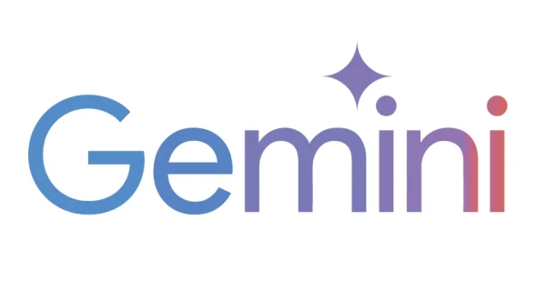
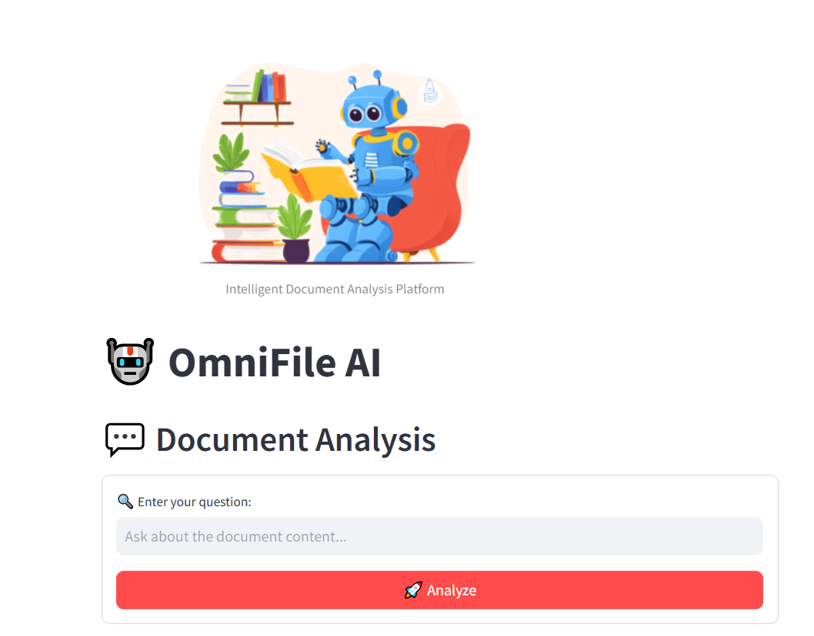

# **🚀 OmniFile AI – Your Intelligent File Analyst 🤖**  

<p align="center">
   
</p>  
  
[](https://opensource.org/licenses/MIT)  
[](https://omnifile-ai.streamlit.app/)  

🔍 **Analyze, Extract, and Interact with Your Documents Like Never Before!**  
OmniFile AI is a **powerful AI-driven app** that lets you chat with your documents, extract insights, and generate smart visualizations – all in one place! 🚀  

---

⚡ Powered by Google Gemini AI
<p align="center">  </p>
OmniFile AI utilizes the Google Gemini API to process and understand documents efficiently, ensuring:
✔ Accurate & Fast Responses using cutting-edge AI
✔ Contextual Understanding of documents, PDFs, and even code files
✔ Seamless Integration for smooth AI-driven interactions

## **✨ Why OmniFile AI?**  

✅ **Supports Multiple File Formats** – PDFs, DOCX, PPTX, XLSX, Code Files, and more!  
✅ **AI-Powered Chat** – Ask **natural language questions** about your documents.  
✅ **Smart Visualizations** – Convert raw data into **charts, tables, and summaries** automatically.  
✅ **Deep Document Analysis** – Extract **key points, insights, and summaries** effortlessly.  
✅ **Real-Time Collaboration** – Share analysis with teammates instantly!  
✅ **Fast & Secure** – All processing is done **privately and efficiently**.  

🎯 **Perfect for:** **Researchers, Professionals, Students, and Developers**  

  

---

## **🚀 Getting Started**  

### **🔧 Installation**  

1️⃣ **Clone the Repository:**  
```bash
git clone https://github.com/yourusername/OmniFile-AI.git
cd OmniFile-AI
```  

2️⃣ **Install Dependencies:**  
```bash
pip install -r requirements.txt
```  

3️⃣ **Run the App:**  
```bash
streamlit run app.py
```  

---

## **📂 Supported File Formats**  

| 📄 Documents | 🧑‍💻 Code Files | 📊 Data Files |
|-------------|---------------|-------------|
| PDF, DOCX, PPTX, TXT, RTF | Python, JavaScript, JSX, Java, GO, ipynb | CSV, XLSX |

---

## **💡 How It Works**  

1️⃣ **Upload your files** – Drag & drop or browse manually.  
2️⃣ **Ask AI-powered questions** – Get instant answers from documents!  
3️⃣ **Generate visual insights** – Charts, tables, and key highlights.  
4️⃣ **Download results** – Save summaries, extractions, and insights.  

---

## **📸 Demo Preview**  

🔹 **Drag & Drop File Upload**  
🔹 **Real-time AI Answers**  
🔹 **Smart Visualizations & Summaries**  

  

---

## **🌍 Try it Live!**  

🔗 **[OmniFile AI – Live Demo](https://omnifile-ai.streamlit.app/)**  

Give it a try and **supercharge your document analysis!** 🚀  

---

## **🤝 Contribute & Support**  

💡 Found a bug? Want to add a feature? Feel free to **fork and contribute!**  

📧 Contact: **virajinduruwa2@gmail.com**  
🌟 If you like this project, **give it a star on GitHub!** ⭐  

---
